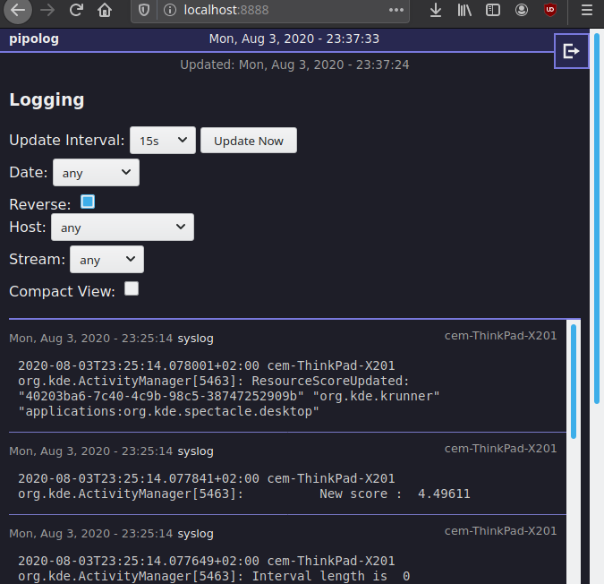

# pipolog

Simple logging aggregator. Server and web-interface.

pipolog-agent features data collection on clients (separate rep.).

Needs a mongodb database.

## Screenshot

## Todo

- test session expiry server-side

- systemd service for agent
- deploy / test on server/production

### Done

- user auth. (Login/Logout etc.) => DONE
