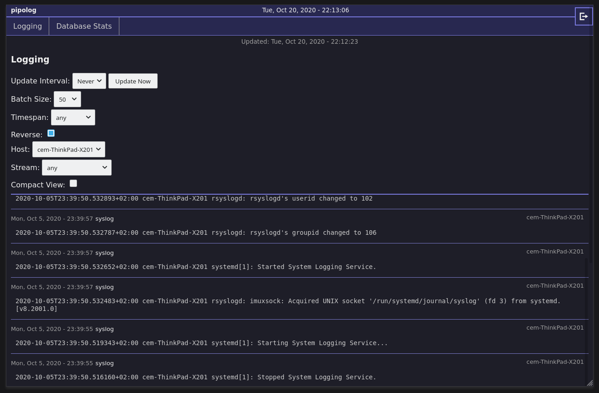
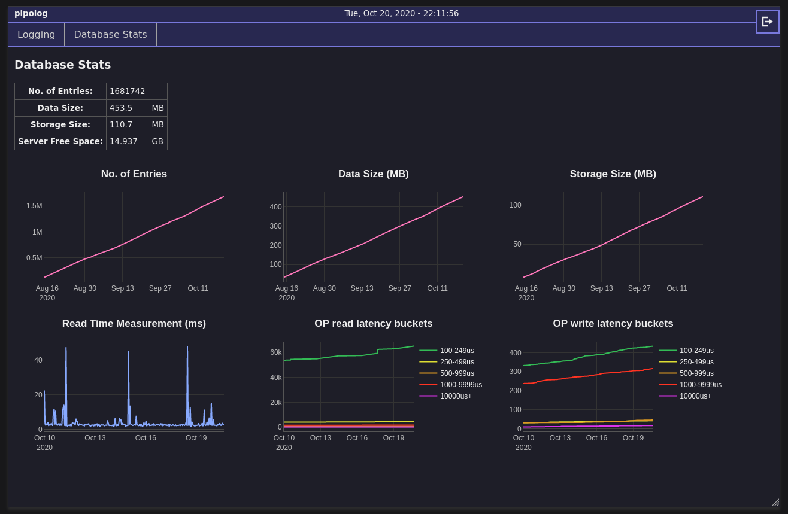

Info: This was made as a personal proof-of-concept / prototype / learning and experimentation project.

__It is currently not maintained or updated.__

Key takeaways / report:

I used this for several years on my personal VPS, with 2GB of VRAM, to collect journal data from itself and a couple
other devices. Performance held up well but it was important to add indexes for certain fields in the database in order to prevent degrading performance.

Keeping up with updates from Javascript dependencies would require a lot of effort and constant adaptions.

# pipolog

A simple logging aggregator. Server and Web-Interface (svelte).

Motivation: Create a simple and resource friendly alternative to existing solutions like graylog.

- clients send data via agent/API (see [pipolog-agent](https://github.com/rebootl/pipolog-agent), separate repo.)
- mongodb instance for storage required

## Screenshots

## Todo

- add info on dbstats collection (hourly)
- data preparation for dbstats graphs on client could be performance optimized
- test session expiry server-side

### Done

- add license => DONE
- deploy / test on server/production => DONE
- systemd service for agent => DONE (in agent)
- user auth. (Login/Logout etc.) => DONE
